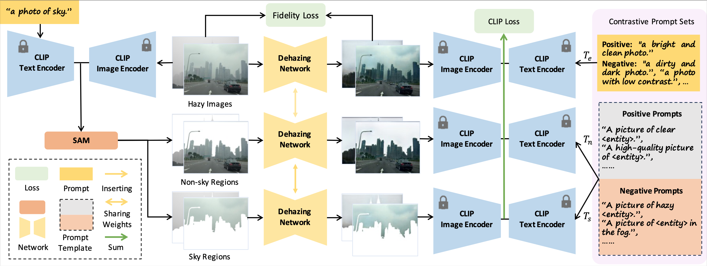

# HazeCLIP: Towards Language Guided Real-World Image Dehazing

<a href="https://arxiv.org/abs/2407.13719"></a>[](https://www.apache.org/licenses/LICENSE-2.0)

This repository contains the implementation of the paper "HazeCLIP: Towards Language Guided Real-World Image Dehazing".

We present HazeCLIP, a language-guided adaptation framework designed to enhance the real-world performance of pre-trained dehazing networks.





## 🛠️ Setup

Set up conda environment via

```bash
conda create -n HazeCLIP python=3.9
conda activate HazeCLIP
pip install -r requirements.txt
```
## 🚀 Usage
Please modify the corresponding yaml configuration file before running the command.

### 🏋️ Inference 

Download checkpoint from [Baidu Yun ](https://pan.baidu.com/s/1TxVUKOrNRGI19BaSBDbwIg)(code: haze) and put it in ./weights/ folder. 

```py
python inference.py --config configs/inference.yaml
```


### 🚀 Training

#### Pre-training

Download synthetic data from [RIDCP](https://github.com/RQ-Wu/RIDCP_dehazing) and put it under ./data/ folder.

```python
python pretrain.py --config configs/pretrain.yaml
```

#### Fine-tuning

Download fine-tuning dataset from [Baidu Yun](https://pan.baidu.com/s/1TxVUKOrNRGI19BaSBDbwIg) (code: haze) and put it under ./data/ folder. 

```pyth
python finetune.py --config configs/finetune.yaml
```


### 🎓 Citation

If you find our work helpful, please consider cite our work as

```bibtex
@misc{wang2024hazecliplanguageguidedrealworld,
      title={HazeCLIP: Towards Language Guided Real-World Image Dehazing}, 
      author={Ruiyi Wang and Wenhao Li and Xiaohong Liu and Chunyi Li and Zicheng Zhang and Xiongkuo Min and Guangtao Zhai},
      year={2024},
      eprint={2407.13719},
      archivePrefix={arXiv},
      primaryClass={cs.CV},
      url={https://arxiv.org/abs/2407.13719}, 
}
```


### 🎫 Acknowledgement

Parts of the codes are adopted from [RIDCP](https://github.com/RQ-Wu/RIDCP_dehazing), [CLIP Surgery](https://github.com/xmed-lab/CLIP_Surgery) and [CLIP-LIT](https://github.com/ZhexinLiang/CLIP-LIT). Thanks for their work!
