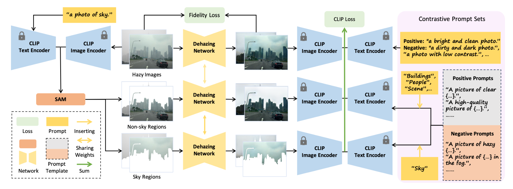
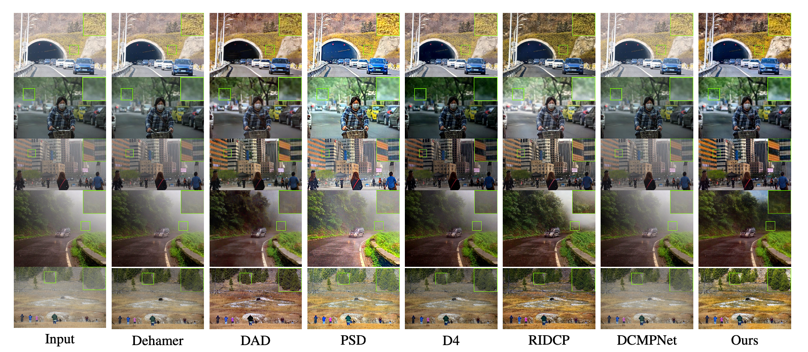

# HazeCLIP: Towards Language Guided Real Image Dehazing

This repository contains the implementation of the paper "HazeCLIP: Towards Language Guided Real Image Dehazing".

We present HazeCLIP, a language-guided adaptation framework designed to enhance the real-world performance of pre-trained dehazing networks.



## 🛠️ Setup
```bash
pip install -r requirements.txt
```
## 🚀 Usage
### 🏋️ Training

### 🚀 Testing
